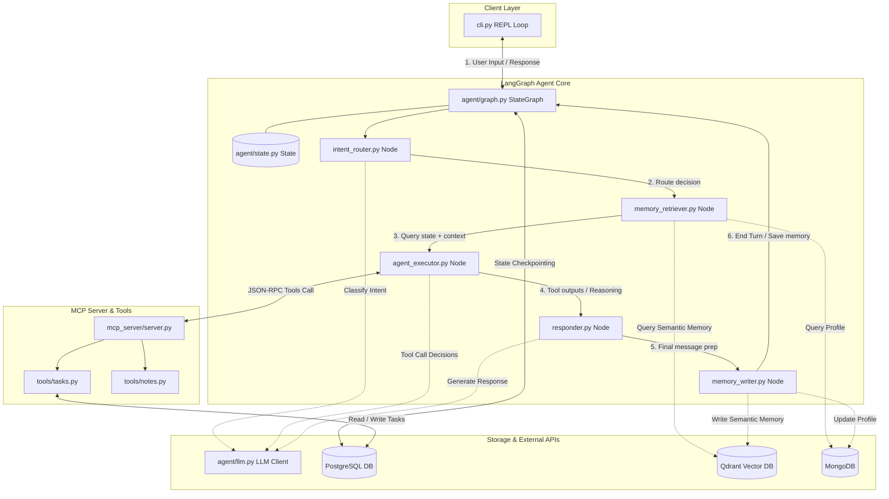

# ContextCore CLI

A local-first, context-aware AI assistant built with LangGraph, MCP, Qdrant, MongoDB, and PostgreSQL.

> **Status:** Work in progress — README will be updated as each step is completed.

---

## What It Does

ContextCore is a CLI agent that:
- Remembers past conversations via PostgreSQL checkpointing (short-term) and Qdrant vector search (long-term semantic memory)
- Maintains a user profile in MongoDB (preferences, facts about you)
- Manages tasks and notes through an MCP (Model Context Protocol) server backed by PostgreSQL
- Routes messages intelligently using a LangGraph graph with conditional edges

---

## Tech Stack

| Layer | Tool |
|---|---|
| Agent framework | LangGraph |
| LLM | Groq (via `langchain-groq`) |
| Short-term memory | PostgreSQL checkpointer |
| Long-term memory | Qdrant (vector search) |
| User profile store | MongoDB |
| Task / note storage | PostgreSQL |
| Tool protocol | MCP (Model Context Protocol) |
| Infrastructure | Docker Compose |

---

## Folder Structure

```
contextcore/
├── docker-compose.yml
├── requirements.txt
├── .env                      # API keys, DB URLs — never committed
├── .env.example
├── .gitignore
├── README.md
│
├── agent/
│   ├── __init__.py
│   ├── graph.py              # LangGraph graph — nodes wired together
│   ├── state.py              # Shared state schema (TypedDict/Pydantic)
│   ├── llm.py                # LLM client setup (Groq etc.)
│   └── nodes/
│       ├── __init__.py
│       ├── intent_router.py
│       ├── memory_retriever.py
│       ├── agent_executor.py
│       ├── memory_writer.py
│       └── responder.py
│
├── mcp_server/
│   ├── __init__.py
│   ├── server.py             # MCP server entrypoint
│   └── tools/
│       ├── __init__.py
│       ├── tasks.py          # create_task, list_tasks, update_task
│       └── notes.py          # save_note, search_notes
│
├── memory/
│   ├── __init__.py
│   ├── qdrant_store.py       # Embedding + similarity search
│   ├── mongo_store.py        # User profile read/write
│   └── embeddings.py         # Embedding model wrapper
│
├── db/
│   ├── __init__.py
│   ├── postgres_models.py    # Tasks table schema
│   └── init_db.sql           # Table creation scripts
│
├── eval/
│   ├── test_cases.json       # 15–20 eval scenarios
│   ├── run_eval.py
│   └── results.md            # Metrics — filled after running
│
├── cli.py                    # Entrypoint — the REPL loop
└── tests/                    # Ad-hoc test scripts while building
```

---

## Architecture Diagram

The diagram below illustrates the relationship between the CLI entrypoint, the LangGraph agent state/nodes, external services, databases, and the Model Context Protocol (MCP) server:



## Setup

> Full setup instructions will be added once each step is stable.

**Prerequisites:** Python 3.11+, Docker Desktop

```bash
# Clone and enter the project
git clone <repo-url>
cd contextcore

# Create virtual environment
python -m venv .venv
.venv\Scripts\activate        # Windows
# source .venv/bin/activate   # Mac/Linux

# Install dependencies
pip install -r requirements.txt

# Copy env template and fill in your keys
cp .env.example .env

# Start infrastructure
docker compose up -d

# Run the CLI
python cli.py
```

---

## Progress Log

| Step | Status |
|------|--------|
| 1 — Skeleton + LLM | ✅ Done |
| 2 — LangGraph loop | ✅ Done |
| 3 — Postgres checkpointing | ✅ Done |
| 4 — MCP server | 🔄 In progress |
| 5 — Agent ↔ MCP | ⬜ Pending |
| 6 — Remaining MCP tools | ⬜ Pending |
| 7 — Qdrant memory | ⬜ Pending |
| 8 — MongoDB profile | ⬜ Pending |
| 9 — Intent router | ⬜ Pending |
| 10 — CLI polish | ⬜ Pending |
| 11 — Eval | ⬜ Pending |
| 12 — Bug fixing | ⬜ Pending |
| 13 — Final README | ⬜ Pending |

---

## License

MIT
