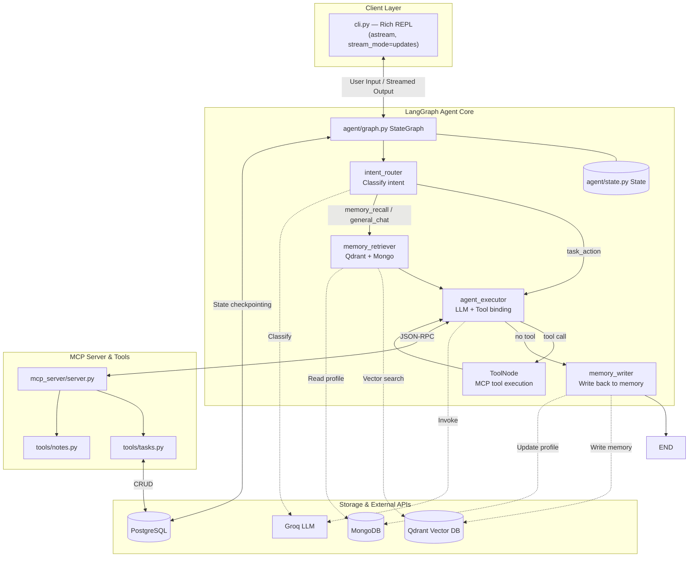

# ContextCore CLI

A local-first, context-aware AI assistant built with LangGraph, MCP, Qdrant, MongoDB, and PostgreSQL.

---

## What It Does

ContextCore is a CLI agent that:
- Remembers past conversations via PostgreSQL checkpointing (short-term) and Qdrant vector search (long-term semantic memory)
- Maintains a user profile in MongoDB (preferences, facts about you)
- Manages tasks and notes through an MCP (Model Context Protocol) server backed by PostgreSQL
- Routes messages intelligently using a LangGraph graph with conditional edges
- Streams responses node-by-node using `graph.astream` with `stream_mode="updates"`
- Displays a polished terminal UI with Rich + ASCII art banner

---

## Tech Stack

| Layer | Tool |
|---|---|
| Agent framework | LangGraph |
| LLM | Groq (via `langchain-groq`) |
| Short-term memory | PostgreSQL checkpointer (`AsyncPostgresSaver`) |
| Long-term memory | Qdrant (vector search, `sentence-transformers`) |
| User profile store | MongoDB |
| Task / note storage | PostgreSQL |
| Tool protocol | MCP (Model Context Protocol) |
| CLI UI | Rich + `art` (ASCII art banner) |
| Infrastructure | Docker Compose |

---

## Folder Structure

```
contextcore/
├── docker-compose.yml
├── requirements.txt
├── .env                      # API keys, DB URLs — never committed
├── .env.example
├── .gitignore
├── README.md
│
├── agent/
│   ├── __init__.py
│   ├── graph.py              # LangGraph graph — nodes wired together
│   ├── state.py              # Shared state schema (TypedDict)
│   ├── llm.py                # LLM client setup (Groq)
│   ├── mcp_client.py         # MCP client — connects to MCP server, fetches tools
│   └── nodes/
│       ├── __init__.py
│       ├── intent_router.py   # Classifies user intent (task_action / memory_recall / general_chat)
│       ├── memory_retriever.py # Queries Qdrant + MongoDB for context
│       ├── agent_executor.py  # LLM invocation with tool binding
│       └── memory_writer.py   # Writes conversation snippets + profile facts
│
├── mcp_server/
│   ├── __init__.py
│   ├── server.py             # MCP server entrypoint (FastMCP)
│   └── tools/
│       ├── __init__.py
│       ├── tasks.py          # create_task, list_tasks, update_task, delete_task
│       └── notes.py          # save_note, search_notes
│
├── memory/
│   ├── __init__.py
│   ├── qdrant_store.py       # Embedding + similarity search
│   ├── mongo_store.py        # User profile read/write
│   └── embeddings.py         # SentenceTransformer wrapper (all-MiniLM-L6-v2)
│
├── db/
│   ├── __init__.py
│   ├── postgres_models.py    # Tasks table schema
│   └── init_db.sql           # Table creation scripts
│
├── eval/
│   ├── test_cases.json       # Eval scenarios
│   ├── run_eval.py
│   └── results.md
│
├── cli.py                    # Entrypoint — REPL loop with Rich + ASCII art banner
└── tests/                    # Ad-hoc test scripts
```

---

## Architecture Diagram



---

## Setup

**Prerequisites:** Python 3.11+, Docker Desktop

```bash
# Clone and enter the project
git clone <repo-url>
cd contextcore

# Create virtual environment
python -m venv .venv
.venv\Scripts\activate        # Windows
# source .venv/bin/activate   # Mac/Linux

# Install dependencies
pip install -r requirements.txt

# Copy env template and fill in your keys
cp .env.example .env
# Required: POSTGRES_URL, GROQ_API_KEY, QDRANT_URL, MONGO_URI

# Start infrastructure
docker compose up -d

# Run the CLI
python cli.py
```

> **Windows note:** The CLI uses `asyncio.SelectorEventLoop` (via `loop_factory`) to ensure compatibility with `psycopg` async PostgreSQL connections, which don't support `ProactorEventLoop`.

---

## Environment Variables

| Variable | Description |
|---|---|
| `GROQ_API_KEY` | Groq API key for LLM access |
| `POSTGRES_URL` | PostgreSQL connection string (used for tasks + checkpointing) |
| `QDRANT_URL` | Qdrant server URL (default: `http://localhost:6333`) |
| `MONGO_URI` | MongoDB connection string |

---

## How It Works

1. **Input** — User types a message in the CLI
2. **Intent routing** — `intent_router` classifies the message as `task_action`, `memory_recall`, or `general_chat`
3. **Memory retrieval** — For non-task intents, `memory_retriever` queries Qdrant (semantic) and MongoDB (profile) to inject context
4. **LLM + tools** — `agent_executor` calls the Groq LLM with bound MCP tools; if a tool is called, `ToolNode` executes it and loops back
5. **Memory writing** — `memory_writer` stores a conversation snippet into Qdrant and extracts any new user preferences into MongoDB
6. **Streaming** — Each node's output is streamed live via `graph.astream(stream_mode="updates")` and displayed with Rich

---

## Progress Log

| Step | Status |
|------|--------|
| 1 — Project skeleton + LLM | ✅ Done |
| 2 — LangGraph loop | ✅ Done |
| 3 — Postgres checkpointing | ✅ Done |
| 4 — MCP server | ✅ Done |
| 5 — Agent ↔ MCP tool binding | ✅ Done |
| 6 — Qdrant long-term memory | ✅ Done |
| 7 — MongoDB user profile | ✅ Done |
| 8 — Intent router | ✅ Done |
| 9 — `astream` streaming output | ✅ Done |
| 10 — CLI polish (Rich + ASCII art) | ✅ Done |
| 11 — Eval | ⬜ Pending |
| 12 — Final README | ✅ Done |

---

## License

MIT
